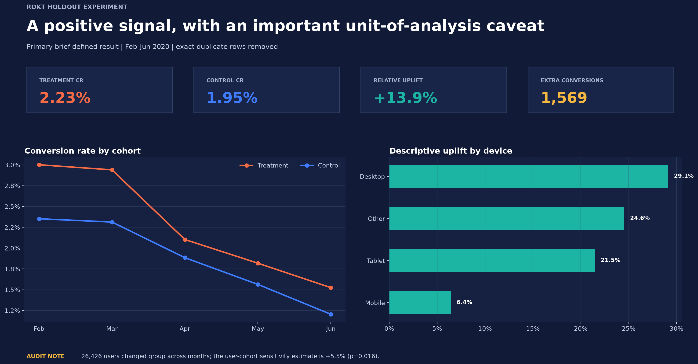
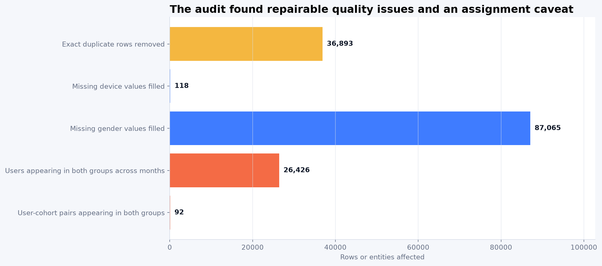

# Rokt Holdout Experiment Analysis



## Executive summary

This project evaluates whether showing Rokt advertisements increased conversion compared with a suppressed-ad holdout. It analyzes **852,197 cleaned campaign-event records** across five monthly cohorts using Python, experiment statistics, sensitivity analysis, and BI-ready outputs.

Under the metric defined in the assignment, treatment converted at **2.23%** versus **1.95%** for control, a **+13.9% relative uplift**. The conventional two-proportion test gives `p = 3.42e-09`.

The experiment audit found that users can change assignment across months. A user-cohort sensitivity analysis estimates **+5.5% uplift (`p = 0.016`)**. The result remains positive, but the magnitude depends on the confirmed randomization unit.

## Headline metrics

| Metric | Result |
|---|---|
| Treatment conversion rate | 2.2261% |
| Control conversion rate | 1.9540% |
| Absolute lift | 0.272% percentage points |
| Relative uplift | +13.93% |
| 95% CI, relative uplift | 9.1% to 19.0% |
| Estimated additional conversions | 1,569 |

## Key findings

- Treatment conversion exceeded control in every cohort; cohort uplift ranged from **11.6% to 27.6%**.
- Conversion declined in both groups from February to June, indicating a material time effect.
- **Desktop** showed the strongest descriptive device uplift at **29.1%**.
- The simple control-rate counterfactual estimates approximately **1,569 additional conversions**.
- Estimated incremental conversion value is **$239,887** under an equal-average-value assumption. It is not labeled Rokt revenue.

## Why the data audit matters

The reproducible pipeline corrects issues that materially affect interpretation:

- Removes one invalid `203902` cohort row.
- Removes **36,893 exact duplicate rows** before calculating VPT and conversion value.
- Correctly fills missing device and gender categories with `fillna()`.
- Identifies **26,426 users** appearing in both groups across months, but only **92 user-cohort pairs** appearing in both groups within a cohort.
- Reports brief-defined, user-cohort, and session-level sensitivity results side by side.



## Business recommendation

Treat the test as a positive experiment signal. Before using the result for rollout or financial forecasting, confirm whether assignment occurred by user, user-cohort, session, or event. Then investigate the overall conversion decline and validate whether the strong Desktop result persists in a follow-up test.

## Project assets

- [Portfolio notebook](notebooks/rokt_ab_test_analysis.ipynb) — cleaned analysis with outputs and interpretation.
- [Interactive dashboard](dashboard/index.html) — self-contained browser dashboard using aggregate data only.
- [Executive summary](reports/executive_summary.pdf) — concise stakeholder report.
- [Methodology](docs/methodology.md) — metric definitions, tests, assumptions, and limitations.
- [Data dictionary](docs/data_dictionary.md) — field-level definitions.

## Repository structure

```text
├── README.md
├── requirements.txt
├── src/analysis.py
├── notebooks/rokt_ab_test_analysis.ipynb
├── dashboard/
├── reports/
├── docs/
├── images/
└── data/aggregated/
```

## Reproduce the analysis

The raw dataset is intentionally not distributed. Place an authorized copy on your computer, then run:

```powershell
python -m pip install -r requirements.txt
python src/analysis.py --input "C:\path\to\rokt_data.csv" --output-root .
```

For the notebook, set `ROKT_DATA_PATH` to the same authorized CSV path.

## Tools demonstrated

`Python` · `pandas` · `NumPy` · `matplotlib` · `A/B testing` · `data quality` · `interactive reporting` · `business communication`

## Data privacy

This public portfolio structure contains aggregate outputs only. Raw campaign data, pseudonymous user/session identifiers, proprietary brief screenshots and extraction passwords are excluded.
